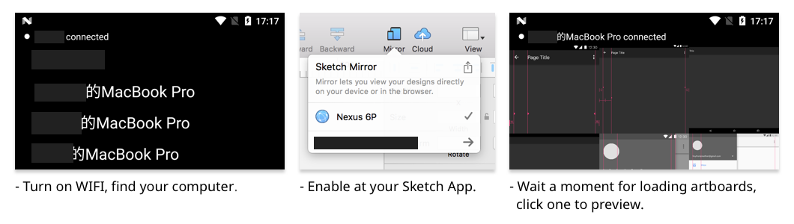

Mirror
===

Yet another Sketch Mirror App for Android.

Support Android Lollipop+.

[Download](https://github.com/zhihu/mirror/releases/download/1.0.0/Mirror.1.0.0.apk "Mirror.1.0.0.apk").

## Usage

## Attention 

 - Sometimes the WIFI connection is unstable, better to use it at good network. USB supports comming soon.

 - Highly recommended to use resolution 1280x720's phone to preview Material Design; or resolution : artboard's size = 1:1.

 - Good Pull Request is always welcome :)

## Dependences

 - [Android Support Library](https://developer.android.com/topic/libraries/support-library/index.html "Support Library"), Apache License Version 2.0

 - [ReactiveX/RxJava](https://github.com/ReactiveX/RxJava "ReactiveX/RxJava"), Apache License Version 2.0

 - [trello/RxLifecycle](https://github.com/trello/RxLifecycle "trello/RxLifecycle"), Apache License Version 2.0

 - [facebook/fresco](https://github.com/facebook/fresco "facebook/fresco"), BSD License

 - [google/gson](https://github.com/google/gson "google/gson"), Apache License Version 2.0

 - [square/okhttp](https://github.com/square/okhttp "square/okhttp"), Apache License Version 2.0

 - [davemorrissey/subsampling-scale-image-view](https://github.com/davemorrissey/subsampling-scale-image-view "davemorrissey/subsampling-scale-image-view"), Apache License Version 2.0
 
## Contributing
 - To contribute with a small fix, simply create a pull request.
 - Better to open an issue to discuss with the team and the community if you're intended to work on something BIG.
 - Please follow [Code Style for Contributors](https://source.android.com/source/code-style) of AOSP.

## License

    Mirror - Yet another Sketch Mirror App for Android.
    Copyright (C) 2016 Zhihu Inc.

    This program is free software: you can redistribute it and/or modify
    it under the terms of the GNU General Public License as published by
    the Free Software Foundation, either version 3 of the License, or
    (at your option) any later version.

    This program is distributed in the hope that it will be useful,
    but WITHOUT ANY WARRANTY; without even the implied warranty of
    MERCHANTABILITY or FITNESS FOR A PARTICULAR PURPOSE.  See the
    GNU General Public License for more details.

    You should have received a copy of the GNU General Public License
    along with this program.  If not, see <http://www.gnu.org/licenses/>.
